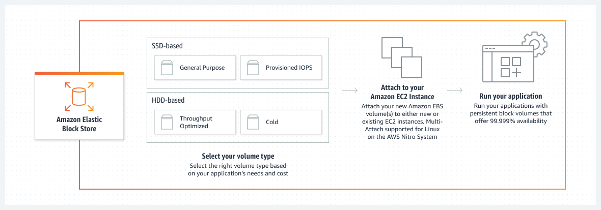

# EBS

#### How it works

Amazon Elastic Block Store (Amazon EBS) is an easy-to-use, scalable, high-performance block-storage service designed for Amazon Elastic Compute Cloud (Amazon EC2).

-   Attach them to Amazon EC2 instances
-   Placed in a specific Availability Zone
-   Automatically replicated to protect you from the failure 
-   Aurable snapshot capabilities and are designed for high availability
-   Optimize storage performance and cost for your workload
-   Divided into two major categories: 
    -   SSD-backed storage (such as databases and boot volumes )
    -   HDD-backed storage for throughput intensive workloads(such as MapReduce and log processing)

##### General Purpose SSD (gp3 and gp2)

-   Balance price and performance for a wide variety of transactional data

##### IOPS(io2)

-   SAN-like performance in the cloud
-   Procure, scale, and maintain expensive on-premises SANs but not in io2
-   Aachieve sub-millisecond latency
-   Up to 256,000 IOPS, 4,000 MB/second throughput, and 64 TB of capacity
-   4x increase in performance, throughput, and capacity than existing io1 volumes
-   for the largest, most I/O-intensive, mission-critical deployments of Oracle databases, SAP HANA, Microsoft SQL Server, InterSystems database, and SAS Analytics

##### Provisioned IOPS SSD

-   SSD-backed volumes include the highest performance
-   For latency-sensitive transactional workloads

##### Optimized HDD (st1)

-   Frequently accessed, throughput intensive workloads

##### Cold HDD (sc1)

-   Throughput intensive workloads and the lowest cost
-   For less frequently accessed data.

#### Conclusion
##### Amazon EBS

-   Allows you to dynamically increase capacity
-   Tune performance
-   Change the type of live volumes with no downtime or performance impact
-   Easily right-size your deployment and adapt to performance changes
---

### Amazon EBS availability and durability

-   Highly available, reliable, and durable
-   No additional charge
-   Replicated across multiple servers in an Availability Zone to prevent the loss of data from the failure of any single component
-   For more details, see the [Amazon EBS Service Level Agreement](https://aws.amazon.com/ebs/sla/).

-   io2 Block Express that is designed to provide 99.999% durability with an annual failure rate (AFR) of 0.001%
-   2000 times more reliable than typical commodity disk drives, which fail with an AFR of around 2%
-   A snapshot feature, which is a good way to take point-in-time backups of your data

---
### Amazon EBS-Optimized instances

-   [hourly fee](https://aws.amazon.com/ebs/pricing/)
-   Dedicated throughput between Amazon EC2 and Amazon EBS, with options between 500 and 80,000 Megabits per second (Mbps) depending on the instance type used
-   Designed for use with all Amazon EBS volume types
-   For more information, see [Amazon EC2 Instance Types](https://docs.aws.amazon.com/AWSEC2/latest/UserGuide/ebs-optimized.html).
---
